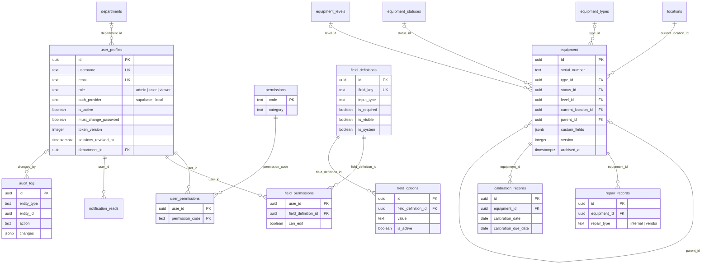

# Bức tranh database — Equipment Management (V2)

> Cập nhật: 2026-09-24 · Trạng thái: sau migration `003_admin_hardening.sql`
>
> Tài liệu này mô tả database **như nó đang có trong code hôm nay**, làm đầu vào cho vòng review database.
> `docs/DATABASE.md` hiện vẫn mô tả mô hình V1 (cột `can_create`…, 9 field cố định) — xem mục 9.

## Mục lục

1. [Tổng quan](#1-tổng-quan)
2. [File nguồn và thứ tự dựng database](#2-file-nguồn-và-thứ-tự-dựng-database)
3. [Sơ đồ quan hệ](#3-sơ-đồ-quan-hệ)
4. [Các bảng](#4-các-bảng)
5. [View](#5-view)
6. [Function / RPC và trigger](#6-function--rpc-và-trigger)
7. [Index](#7-index)
8. [Truy cập, bảo mật và đồng thời](#8-truy-cập-bảo-mật-và-đồng-thời)
9. [Điểm cần đưa vào vòng review](#9-điểm-cần-đưa-vào-vòng-review)

---

## 1. Tổng quan

| | |
|---|---|
| Nền tảng | PostgreSQL trên Supabase (schema `public`) |
| Quy mô | **18 bảng · 1 view · 28 function** |
| Quy mô dữ liệu mục tiêu | Pilot 10–20 người dùng, 1.000–2.000 thiết bị |
| Ai được chạm vào DB | Chỉ server Next.js, qua client `service_role` trong `lib/services/*`. Trình duyệt không bao giờ truy vấn DB trực tiếp. |
| Phân quyền thật | `withAuth()` (`lib/auth/withAuth.ts`) trên mọi API route. RLS bật deny-all trên mọi bảng, chỉ là lớp chặn dự phòng cho anon key. |
| Nguyên tắc | Không xoá cứng dữ liệu nghiệp vụ (thiết bị archive, danh mục deactivate) · khoá lạc quan bằng `version` · thao tác nhiều dòng chạy trong RPC `plpgsql` · mọi thay đổi ghi `audit_log`. |

Các bảng chia 6 nhóm:

| Nhóm | Bảng |
|---|---|
| Người dùng & phân quyền | `user_profiles`, `permissions`, `user_permissions`, `field_permissions`, `departments` |
| Danh mục (master data) | `locations`, `equipment_types`, `equipment_statuses`, `equipment_levels` |
| Lõi | `equipment` |
| Cấu hình field | `field_definitions`, `field_options` |
| Vòng đời thiết bị | `repair_records`, `calibration_records` |
| Hệ thống | `app_settings`, `audit_log`, `error_log`, `notification_reads` |

---

## 2. File nguồn và thứ tự dựng database

Chạy lần lượt trong Supabase SQL Editor (project dev trước):

| # | File | Nội dung |
|---|---|---|
| 1 | [`database/full_reset.sql`](../database/full_reset.sql) | **Xoá sạch** rồi tạo lược đồ gốc V2: 16 bảng, view hiệu chuẩn, RPC thiết bị, RLS, grant. |
| 2 | [`database/migrations/001_departments.sql`](../database/migrations/001_departments.sql) | Bảng `departments`; `user_profiles.department` (text) → `department_id` (FK). |
| 3 | [`database/migrations/002_notification_reads.sql`](../database/migrations/002_notification_reads.sql) | Bảng `notification_reads`. |
| 4 | [`database/migrations/003_admin_hardening.sql`](../database/migrations/003_admin_hardening.sql) | RPC admin (transaction), `sessions_revoked_at`, bỏ quyền `user.manage`, giữ `error_log` 90 ngày. |
| 5 | [`database/seed/001_seed.sql`](../database/seed/001_seed.sql) | Dữ liệu khởi đầu — **sửa trước khi chạy**: location, type/status/level, danh mục quyền, field hệ thống, cài đặt hiệu chuẩn. |
| 6 | `npx tsx scripts/seed-first-admin.ts <email> "<Tên>" <username>` | Tạo tài khoản admin đầu tiên (Supabase Auth + `user_profiles`). |

`database/archive/v1/` là lược đồ V1 cũ, chỉ để tham khảo.

---

## 3. Sơ đồ quan hệ

### 3.1 Tổng quát

```
                    departments ──1:N──┐
                                       ▼
 permissions ──1:N──< user_permissions >──N:1── user_profiles ──1:N──< notification_reads
 (danh mục quyền)                                   │   │
                    field_permissions >──N:1────────┘   └─ created_by / updated_by / archived_by
                           │                               (hầu hết các bảng)
                           N:1
                           ▼
 field_options >──N:1── field_definitions ·····► định nghĩa key trong equipment.custom_fields (jsonb)

 locations ──────────1:N──┐
 equipment_types ────1:N──┤
 equipment_statuses ─1:N──┼──< equipment ◄──┐ parent_id (tự tham chiếu → cây, tối đa 50 tầng)
 equipment_levels ───1:N──┘      │  └───────┘
                                 ├──1:N──< repair_records
                                 └──1:N──< calibration_records
                                              │
          app_settings('calibration') ────────┴──► VIEW equipment_calibration_status

 audit_log  (entity_type + entity_id, cố ý không có FK)      error_log (không FK)
```

### 3.2 Chi tiết (Mermaid — hiển thị trên GitHub/GitLab)



---

## 4. Các bảng

Quy ước chung: khoá chính `id uuid default gen_random_uuid()` (trừ khi ghi khác); `created_at`/`updated_at timestamptz`; `updated_at` được trigger `set_updated_at` tự cập nhật; `created_by`/`updated_by` tham chiếu `user_profiles(id)`.

### 4.1 Người dùng & phân quyền

#### `user_profiles` — mọi tài khoản

| Cột | Kiểu | Ghi chú |
|---|---|---|
| `id` | uuid PK | Với tài khoản Supabase = `auth.users.id` (**không có FK**, vì tài khoản local không có dòng bên `auth.users`). |
| `full_name` | text, bắt buộc | |
| `username` | text, bắt buộc | Duy nhất (không phân biệt hoa thường); định dạng `^[a-z0-9][a-z0-9._+-]{0,63}$`. Là tên đăng nhập. |
| `email` | text | Duy nhất khi có. Bắt buộc với tài khoản Supabase (là email đăng nhập). |
| `employee_id` | text | |
| `department_id` | uuid FK → `departments` | Từ migration 001. |
| `role` | text | `admin` \| `user` \| `viewer` (mặc định `viewer`). |
| `is_active` | boolean | Tài khoản tự đăng ký vào với `false`; admin bấm Reactivate để duyệt. |
| `must_change_password` | boolean | `true` khi admin đặt mật khẩu (tạo mới / reset) → bắt đổi ở lần đăng nhập tới. |
| `auth_provider` | text | `supabase` (Supabase Auth) \| `local` (app tự xác thực). |
| `password_hash` | text | Chỉ có với `local` (`scrypt:<salt>:<hash>`); ràng buộc check bắt buộc nhất quán với `auth_provider`. |
| `token_version` | integer | Tăng khi đổi mật khẩu tài khoản local → cookie cũ mất hiệu lực. |
| `sessions_revoked_at` | timestamptz | Từ migration 003. Tài khoản Supabase: phiên đăng nhập trước mốc này bị từ chối. |

#### `permissions` — danh mục mã quyền
`code` (PK, ví dụ `equipment.create`), `display_label`, `category`, `description`, `display_order`.
Seed có 12 mã: `equipment.create/move/detach/archive`, `repair.view/create/update`, `calibration.view/create/update`, `master_data.manage`, `field.manage`. Một mã chỉ có tác dụng khi code ứng dụng kiểm tra nó.

#### `user_permissions` — user được cấp mã quyền nào
PK (`user_id`, `permission_code`); `granted_by`, `granted_at`. Xoá cascade theo user hoặc theo mã quyền.
Chỉ có ý nghĩa với `role = 'user'`: admin bỏ qua mọi kiểm tra; viewer luôn chỉ xem (tự có mọi mã `*.view`).

#### `field_permissions` — user được sửa field nào
PK (`user_id`, `field_definition_id`); `can_edit`, `updated_by`, `updated_at`. Xoá cascade theo user hoặc theo field. Không có dòng = không được sửa.

#### `departments` — danh mục phòng ban (migration 001)
`code` (unique), `display_name`, `description`, `display_order`, `is_active`, `created_by/at`, `updated_by/at`.

### 4.2 Danh mục (master data)

Không bao giờ xoá cứng — ngừng dùng bằng `is_active = false` để thiết bị cũ vẫn hiển thị đúng.

| Bảng | Cột | Đặc biệt |
|---|---|---|
| `locations` | `code` (unique), `name`, `sort_order`, `is_active` | Giữ nguyên hình dạng V1: dùng `name`/`sort_order` thay vì `display_name`/`display_order`, **không có** `created_by`/`updated_by`. UI chuẩn hoá lại trong `MasterDataTable`. |
| `equipment_types` | `code` (unique), `display_name`, `description`, `display_order`, `is_active` | Swap chỉ cho phép giữa hai thiết bị cùng `type_id`. |
| `equipment_statuses` | như trên + `requires_remark` | `requires_remark = true` → thiết bị ở status này bắt buộc có Remark (kiểm tra trong RPC). |
| `equipment_levels` | như `equipment_types` | |

### 4.3 Lõi — `equipment`

| Cột | Kiểu | Ghi chú |
|---|---|---|
| `serial_number` | text, bắt buộc | **Không unique** — trùng Part Number + Serial chỉ cảnh báo (`DUPLICATE_WARNING`). |
| `part_number`, `jabil_id`, `asset`, `remark` | text | |
| `type_id` / `status_id` / `level_id` | uuid FK, có thể null | Tham chiếu 3 bảng danh mục. |
| `current_location_id` | uuid FK, bắt buộc | Thiết bị có cha thì location **tự theo cha**, chỉ đổi qua Move/Swap/Detach. |
| `parent_id` | uuid FK → `equipment`, `on delete restrict` | Cây thiết bị; check không cho tự làm cha của chính mình; RPC chặn vòng lặp và giới hạn 50 tầng. |
| `calibration_required` | boolean | |
| `custom_fields` | jsonb, mặc định `{}` | Giá trị của các field admin tự tạo: `{ field_key: value }`. |
| `version` | integer | Khoá lạc quan — mọi RPC ghi đều so `version`. |
| `archived_at` / `archived_by` | | Xoá mềm. Không archive được khi còn con chưa archive. |
| `serial_sort` | text (cột tính sẵn, stored) | Khoá sắp xếp serial theo phần số. |

### 4.4 Cấu hình field

#### `field_definitions` — metadata hiển thị của mọi field
`field_key` (unique), `display_label`, `data_type` (`text|number|date|boolean`), `input_type` (`text|textarea|number|date|boolean|dropdown|location_ref|type_ref|status_ref|level_ref`), `is_required`, `is_visible`, `display_order`, `max_length`, `help_text`, `placeholder`, `is_system`, `updated_by/at`.

- **Field hệ thống** (`is_system = true`, 10 field trong seed): `serial_number`, `part_number`, `jabil_id`, `asset`, `types`, `level`, `status`, `current_location_id`, `calibration_required`, `remark`. Chỉ sửa được nhãn/bắt buộc/ẩn hiện/thứ tự; không xoá, không đổi kiểu.
- **Field tuỳ chỉnh** (`is_system = false`): admin tạo; giá trị nằm trong `equipment.custom_fields`; xoá được (RPC `admin_delete_custom_field` dọn luôn giá trị trong mọi thiết bị).
- 4 kiểu `*_ref` lấy lựa chọn từ bảng danh mục tương ứng, không dùng `field_options`.
- `parent_id` cố ý **không** có trong bảng này — cha chỉ đổi qua thao tác có quyền riêng.

#### `field_options` — lựa chọn của dropdown tuỳ chỉnh
`field_definition_id` (FK, cascade), `value`, `label`, `display_order`, `is_active`, `created_by/at`, `updated_by/at`. Unique (`field_definition_id`, `value`).

### 4.5 Vòng đời thiết bị

#### `repair_records`
`equipment_id` (FK), `repair_type` (`internal|vendor`), `problem`, `repair_start_date`, `repair_end_date` (≥ ngày bắt đầu), `vendor_name`, `repair_action`, `repair_result`, `quotation_ref`, `repair_cost numeric(12,2)`, `remark`, `created_by/at`, `updated_by/at`.

#### `calibration_records`
`equipment_id` (FK), `calibration_date`, `calibration_due_date` (≥ ngày hiệu chuẩn), `calibrated_by` (text tự do — thường là vendor, khác với `created_by` là người nhập), `created_by/at`.
Không có `updated_at`/`updated_by` dù bản ghi sửa được (quyền `calibration.update`).

### 4.6 Hệ thống

#### `app_settings`
`key` (PK), `value jsonb`, `updated_by/at`. Hiện có một key: `calibration` → `{"due_soon_days": 30}`.

#### `audit_log` — nhật ký thay đổi
| Cột | Ghi chú |
|---|---|
| `entity_type` | Check: `equipment`, `user`, `field`, `location`, `equipment_type`, `equipment_status`, `equipment_level`, `department`, `repair`, `calibration`, `permission`. |
| `entity_id` | uuid, **cố ý không FK** để log sống sót khi đối tượng bị xoá. |
| `action` | Xem bảng dưới. |
| `changes` | jsonb dạng `{ cột: { old, new } }`. |
| `changed_by` | FK → `user_profiles`. |
| `request_id`, `source` (`ui|migration|script`), `note` | |

| entity_type | action |
|---|---|
| `equipment` | `CREATE`, `UPDATE`, `CHANGE_LOCATION`, `MOVE`, `DETACH`, `SWAP`, `MOVE_CASCADE` (con đổi location theo cha), `ARCHIVE`, `RESTORE` |
| `user` | `USER_CREATE`, `USER_ROLE_CHANGE`, `USER_PERMISSION_UPDATE`, `USER_REACTIVATE`, `USER_DEACTIVATE`, `USER_PASSWORD_RESET` (admin đặt), `USER_PASSWORD_CHANGE` (tự đổi), `USER_PROFILE_UPDATE` |
| `field` | `FIELD_CONFIG_UPDATE`, `FIELD_DELETE` (lưu cả giá trị đã xoá) |
| `location` | `LOCATION_CONFIG_UPDATE` |
| `equipment_type/status/level`, `department` | `CREATE`, `UPDATE` |
| `repair`, `calibration` | `CREATE`, `UPDATE` |
| `permission` | `FIELD_CONFIG_UPDATE` — thực chất là thay đổi cài đặt hiệu chuẩn (`app_settings`), nhãn chưa khớp. |

#### `error_log`
`request_id`, `route`, `user_id` (không FK), `error_code`, `message`, `stack`, `created_at`. Chỉ ghi lỗi 5xx. Trigger xoá bản ghi cũ hơn 90 ngày (migration 003).

#### `notification_reads` (migration 002)
PK (`user_id`, `notification_key`), `read_at`. Chỉ lưu "đã đọc"; nội dung thông báo được tính ra từ view hiệu chuẩn. Khoá gồm `equipment_id + status + due_date`, nên khi trạng thái đổi thì thông báo tự hiện lại là chưa đọc.

---

## 5. View

### `equipment_calibration_status`
Tính khi đọc, không lưu: với mỗi thiết bị lấy bản ghi hiệu chuẩn mới nhất rồi suy ra `calibration_status`:

| Giá trị | Điều kiện |
|---|---|
| `NOT_REQUIRED` | `calibration_required = false` |
| `NOT_CALIBRATED` | Cần hiệu chuẩn nhưng chưa có bản ghi |
| `OVERDUE` | Hạn < hôm nay |
| `DUE_SOON` | Hạn ≤ hôm nay + `app_settings.calibration.due_soon_days` (mặc định 30) |
| `VALID` | Còn lại |

Dùng bởi: chi tiết thiết bị, Dashboard, trung tâm thông báo (`lib/services/calibration.ts`, `dashboard.ts`, `notifications.ts`).

---

## 6. Function / RPC và trigger

Tất cả chỉ `service_role` được gọi (đã thu quyền của `public`, `anon`, `authenticated`). Lỗi nghiệp vụ được `raise exception '<MÃ_LỖI>'`; `mapRpcError` (`lib/errors`) chuyển thành lỗi API.

### 6.1 Ghi thiết bị — mỗi lệnh một transaction (`full_reset.sql`)

| RPC | Việc làm |
|---|---|
| `create_equipment_with_audit` | Tạo thiết bị; kế thừa location của cha; kiểm tra `requires_remark`; ghi audit `CREATE`. |
| `update_equipment_with_audit` | Sửa các cột được phép (không gồm location/parent); so `version`; audit chỉ ghi phần thay đổi. |
| `change_location_equipment` | Đổi location thiết bị gốc (không có cha) và lan xuống toàn bộ cây con. |
| `move_equipment` | Đổi cha; chặn vòng lặp; lan location của cha mới xuống cây con. |
| `detach_equipment` | Tách khỏi cha, giữ nguyên location. |
| `swap_equipment` | Hoán đổi vị trí hai thiết bị cùng type, không có quan hệ cha–con. |
| `archive_equipment` / `restore_equipment` | Xoá mềm / khôi phục (không restore được nếu cha đang archive). |

Các RPC cấu trúc đặt `lock_timeout` 3s; đổi location/move/detach/swap thêm `statement_timeout` 8s.

### 6.2 Đọc cây thiết bị
`get_equipment_ancestors(id)`, `get_equipment_descendants(id)` — CTE đệ quy, giới hạn 50 tầng.

### 6.3 Hàm nội bộ cho thiết bị
`internal_subtree_ids`, `internal_ancestor_ids` (chặn quá 50 tầng → `DEPTH_LIMIT_EXCEEDED`), `internal_lock_rows` (khoá theo thứ tự `id`, tránh deadlock), `internal_cascade_location` (ghi `MOVE_CASCADE` cho từng con), `internal_move` (lõi dùng chung cho move/detach/swap).

### 6.4 Admin (migration 003)

| RPC | Việc làm |
|---|---|
| `admin_create_user` | Tạo profile + cấp quyền + audit trong một transaction (dòng `auth.users` do app tạo trước; lỗi thì app xoá lại). |
| `admin_set_user_access` | Vai trò + mã quyền + field được sửa, một transaction; audit ghi old → new. |
| `admin_set_user_active` | Kích hoạt / vô hiệu hoá. |
| `admin_record_password_reset` | Sau khi admin đặt mật khẩu: local → lưu hash + tăng `token_version`; Supabase → đặt `sessions_revoked_at`. Bật `must_change_password`. |
| `admin_delete_custom_field` | Xoá field tuỳ chỉnh + dọn key khỏi mọi thiết bị bằng một câu lệnh; giá trị bị xoá lưu vào audit. |
| `admin_blocked_creators` | User có `equipment.create` nhưng không được sửa một field (bẫy Required × quyền). |
| `admin_grant_field_edit` | Cấp quyền sửa field đó cho những user trên. |

Ràng buộc chung do các RPC này bảo đảm: admin không tự vô hiệu hoá / tự hạ vai trò / tự reset mật khẩu (`CANNOT_MODIFY_SELF`); luôn còn ít nhất một admin đang hoạt động (`LAST_ADMIN`). Hàm nội bộ: `internal_lock_admins`, `internal_assert_admin_remains`, `internal_apply_user_grants`, `internal_blocking_required_fields`.

### 6.5 Trigger
- `set_updated_at` — BEFORE UPDATE trên 11 bảng có `updated_at`.
- `trg_error_log_retention` → `internal_purge_error_log` — sau mỗi lần ghi `error_log`, xoá bản ghi quá 90 ngày.

### 6.6 Ghi trực tiếp (không qua RPC)
Các service dưới đây ghi bằng `insert`/`update` của PostgREST rồi ghi `audit_log` bằng một lệnh riêng — **không nằm chung transaction**:
repair (`repair.ts`), calibration (`calibration.ts`), danh mục (`master-data.ts`), location, cấu hình field và option (`admin.ts`), hồ sơ cá nhân và tự đổi mật khẩu (`account.ts`), đăng ký tài khoản (`signup.ts`).

---

## 7. Index

| Bảng | Index |
|---|---|
| `equipment` | `serial_number`, `part_number`, `asset`, `parent_id`, `archived_at`; partial (`where archived_at is null`): `current_location_id`, `status_id`, `type_id`, `calibration_required` |
| `audit_log` | `(entity_id, created_at desc) where entity_type = 'equipment'`; `(created_at desc)` |
| `error_log` | `request_id`; `(created_at desc)` |
| `user_profiles` | unique `lower(email)` (khi có email); unique `lower(username)` |
| Danh mục | `(sort_order, code)` cho `locations`; `(display_order, code)` cho types/statuses/levels/departments |
| `field_options` | `(field_definition_id, display_order)` |
| `user_permissions` | `user_id` (trùng với cột đầu của PK) |
| `notification_reads` | `user_id` (trùng với cột đầu của PK) |
| `repair_records` | `(equipment_id, created_at desc)` |
| `calibration_records` | `(equipment_id, calibration_date desc)` |

Chưa có: index cho `equipment.level_id` (trong khi type/status/location đều có), GIN cho `equipment.custom_fields`, index cho `audit_log.entity_type` ngoài `equipment`. Với quy mô 1.000–2.000 thiết bị, các thiếu sót này chưa ảnh hưởng hiệu năng.

---

## 8. Truy cập, bảo mật và đồng thời

- **RLS deny-all** trên mọi bảng; `anon`/`authenticated` bị thu mọi quyền trên bảng, sequence, function. `service_role` được `grant all`.
- **Phân quyền nằm ở ứng dụng**: `withAuth` kiểm tra phiên → profile → `is_active` → phiên bị thu hồi → `must_change_password` → role → mã quyền; quyền sửa từng field kiểm tra bằng `assertFields`.
- **Hai loại phiên**: Supabase Auth (cookie của Supabase) và local (cookie ký HMAC, `lib/auth/localSession.ts`). Thu hồi phiên: local qua `token_version`, Supabase qua `sessions_revoked_at` so với `last_sign_in_at`.
- **Đồng thời**: khoá lạc quan bằng `equipment.version` (`OPTIMISTIC_CONFLICT`); khoá dòng `for update` theo thứ tự `id` trong các RPC cấu trúc; timeout ngắn để không treo (`LOCK_TIMEOUT`).
- **ESLint** chặn import `lib/supabase/admin` ngoài `lib/services/**`, `lib/auth/**`, `scripts/**`.

---

## 9. Điểm cần đưa vào vòng review

Phát hiện khi lập tài liệu này — đã kiểm tra trong code, **chưa sửa**.

| # | Vấn đề | Chi tiết | Mức |
|---|---|---|---|
| 1 | `audit_log` không thực sự chỉ-ghi-thêm | `full_reset.sql` chỉ `revoke update, delete ... from public`, nhưng `service_role` (role app dùng) vẫn có `grant all` nên sửa/xoá được log. `docs/DATABASE.md` lại khẳng định log không sửa/xoá được. | Cao |
| 2 | `full_reset.sql` không còn là reset đầy đủ | Không drop `departments`, `notification_reads`; vẫn tạo cột `department` (text). Chạy lại `full_reset` rồi `001` trên DB đã có dữ liệu sẽ lỗi "bảng đã tồn tại". Nên gộp 001–003 vào `full_reset.sql`. | Cao |
| 3 | Ghi không nằm trong transaction | Xem mục 6.6. Repair và calibration còn **bỏ qua lỗi** khi ghi audit → có thể có bản ghi mà không có audit. Import Excel ghi từng dòng, lỗi giữa chừng không hoàn tác phần đã ghi, và luôn đặt `source = 'ui'`. | Trung bình |
| 4 | `user_profiles.id` không liên kết `auth.users` | Xoá user trong Supabase Dashboard để lại profile mồ côi (và ngược lại). | Trung bình |
| 5 | Cấu trúc không đồng nhất | `locations` khác các bảng danh mục khác; `calibration_records` sửa được nhưng không có `updated_at`/`updated_by`; `field_permissions.can_edit` thừa (dòng `false` = không có dòng); audit cài đặt hiệu chuẩn dùng `entity_type = 'permission'` + `FIELD_CONFIG_UPDATE`. | Thấp |
| 6 | `serial_number` không unique | Chỉ cảnh báo khi trùng Part Number + Serial. Cần chốt đây là chủ đích nghiệp vụ hay nên ràng buộc. | Cần quyết định |
| 7 | `notification_reads` không bao giờ dọn | Mỗi lần trạng thái hiệu chuẩn đổi sinh key mới; key cũ ở lại mãi. Nhỏ ở quy mô pilot. | Thấp |
| 8 | Tài liệu và test DB lỗi thời | `docs/DATABASE.md` mô tả V1; README còn liệt kê migration V1 (`001_tables.sql`…); `database/test/001_rpc_tests.sql` dùng cột V1 (`types`), còn `run.sh` chỉ chạy `migrations/0*.sql` mà không chạy `full_reset.sql` → bộ test không chạy được. | Trung bình |
| 9 | Index | Thiếu `equipment.level_id`; index `user_id` trên `user_permissions`/`notification_reads` trùng với PK. | Thấp |
