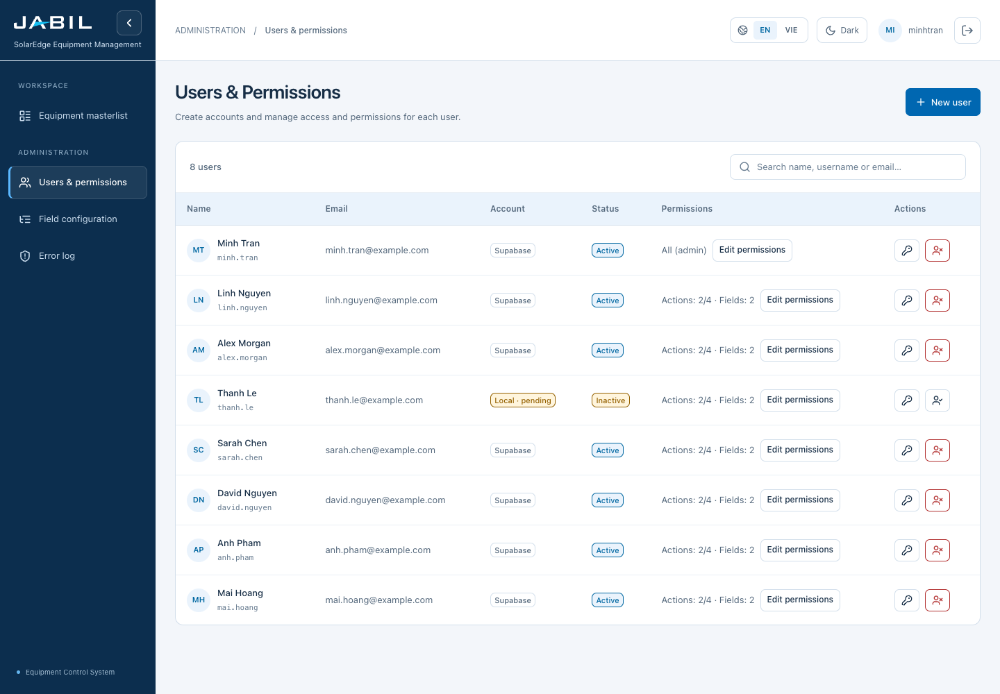
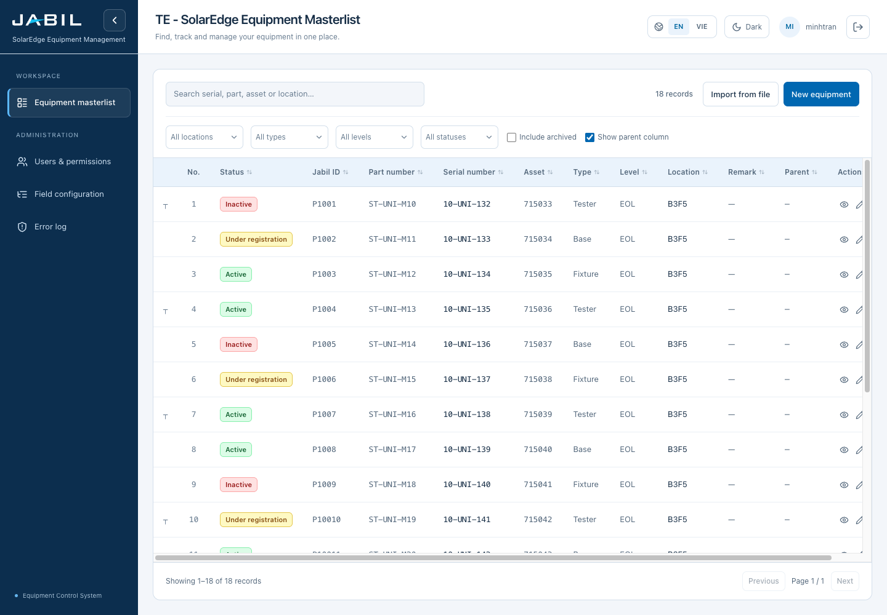
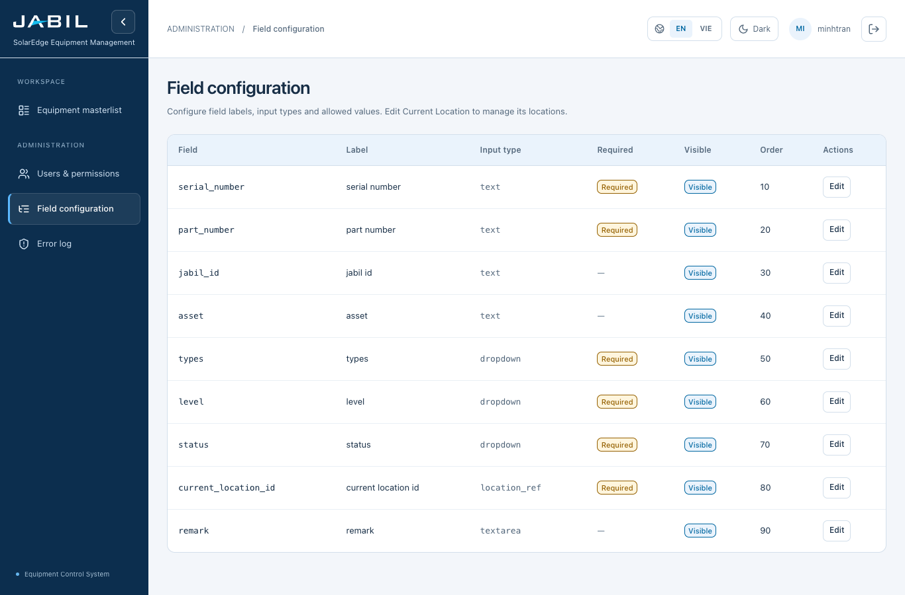

# UI layout review

> Historical layout review. The current palette, typography and component styling are documented in [Jabil interface system](JABIL_UI.md). Screenshots below predate the September 23 brand redesign.

Updated: 20 September 2026. Implemented in the current application.

This redesign follows the reference's clear sidebar, pale table headers, neatly aligned rows and restrained spacing. All existing light/dark color variables, the Jabil logo and equipment status colors are preserved.

## Screenshots

These screenshots render the actual application components with read-only sample data. They are layout previews, not screenshots of production records.

### Users and permissions — desktop

### Equipment masterlist — desktop

### Field configuration — desktop

### Phone and dark mode

- [Masterlist on a phone](ui/masterlist-phone.png)
- [User form on a phone](ui/user-dialog-phone.png)
- [Users in dark mode](ui/users-dark.png)

## Layout decisions

| Area | Implemented behavior |
| --- | --- |
| Brand and navigation | Navy sidebar with consistent navigation spacing, blue active indicator and existing Jabil logo. |
| Top bar | Masterlist title and subtitle remain at the top. Admin screens display navigation context. Language, theme and account controls share an aligned row. |
| Content | Consistent page margins, clear page headings and white panels. |
| Tables | Existing pale blue tint for headers, fine row dividers, readable labels and comfortable row padding. |
| Masterlist toolbar | Search on the left; record count, Import and New equipment on the right. Filters and display settings are grouped underneath. |
| Users | Search by name, username or email, with a matching user count. Name and username share one cell with an initials avatar. Permissions remain individually configurable. |
| User actions | Compact password and activate/deactivate icons with accessible names and hover labels. Edit permissions retains its text label. |
| Administration navigation | The sidebar contains all admin pages. Duplicate page tabs are hidden when it is open; desktop users can still switch sections when it is collapsed. Phones use the menu. |
| Dialogs | Header and Close control remain visible while the form body scrolls. Form columns stack on phones. |
| Dropdowns | Searchable menus stay within the viewport and open upward when space below is limited. |
| Hierarchy | Existing compact Type-based cards and responsive connected tree remain available. |

## Responsive behavior

- **Wide desktop:** sidebar and header controls are visible; masterlist rows use the remaining viewport height.
- **Smaller laptop:** the masterlist heading moves to a second header row to avoid crowding account controls.
- **Tablet and phone, 800px and below:** navigation becomes an overlay menu; toolbars wrap and filters use two columns where space permits.
- **Phone forms:** fields stack into one column; Close stays accessible and the form scrolls internally.
- **Wide data tables:** horizontal scrolling stays inside the table panel, preserving all columns. Tables do not become mobile cards in this update.
- **Touch controls:** shared buttons and row action controls have larger targets on small screens.
- **Dark mode and Vietnamese:** use the same layout rules and existing theme/translations.

## Source files

| File | Responsibility |
| --- | --- |
| [app/globals.css](../app/globals.css) | Shared layout, typography, tables, spacing and responsive rules. |
| [components/AppShell.tsx](../components/AppShell.tsx) | Shell and sidebar state. |
| [components/TopBar.tsx](../components/TopBar.tsx) | Branding, page context, account controls and sidebar links. |
| [app/(app)/page.tsx](../app/(app)/page.tsx) | Masterlist toolbar organization. |
| [app/(app)/admin/users/page.tsx](../app/(app)/admin/users/page.tsx) | User search, identities and compact actions. |
| [components/ui/index.tsx](../components/ui/index.tsx) | Shared buttons, tags and dialogs. |
| [components/ui/SearchableSelect.tsx](../components/ui/SearchableSelect.tsx) | Dropdown viewport positioning. |
| [English](../src/i18n/locales/en.json) / [Vietnamese](../src/i18n/locales/vi.json) | Search, count and user-management copy. |

## Validation

- TypeScript check passed.
- Production build passed, including lint and type validation.
- All 69 existing tests passed.
- Chrome checked actual components with sample data at 320px, 390px, 768px, 1366px and 1440px widths, including light/dark and English/Vietnamese scenarios.
- Checked page/header containment, loaded table rows, user search, phone dialog bounds, menu focus containment, Escape dismissal and phone dropdown containment.
- Verified every existing light/dark CSS color variable is unchanged.
- Existing non-blocking warnings remain: multiple workspace lockfiles during build, and missing i18next test initialization in two component test files.
- Live database mutations and production authentication were not part of these visual checks.

## Your adjustment notes

Edit this section with the changes you want next.

| Area | Requested adjustment |
| --- | --- |
| Sidebar / header | |
| Masterlist | |
| Users and permissions | |
| Field configuration | |
| Phone layout | |
| Hierarchy | |
| Typography / spacing | |
